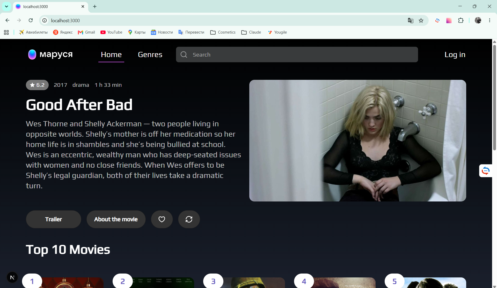
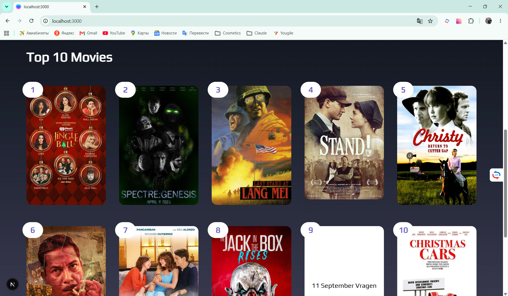
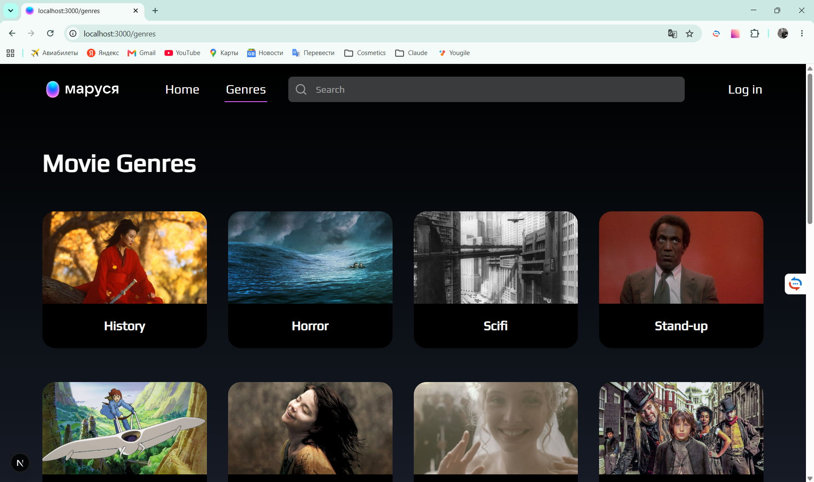
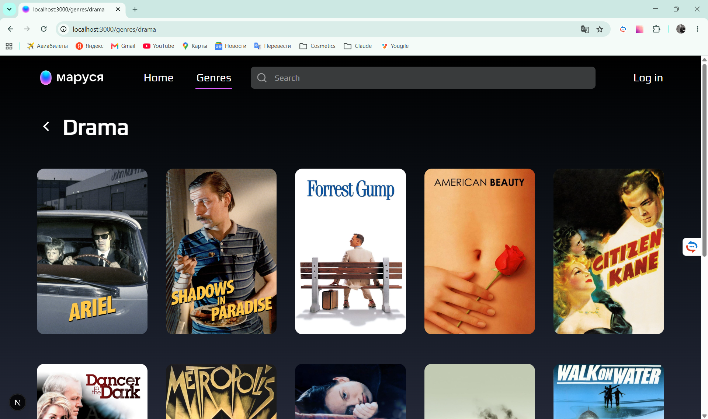
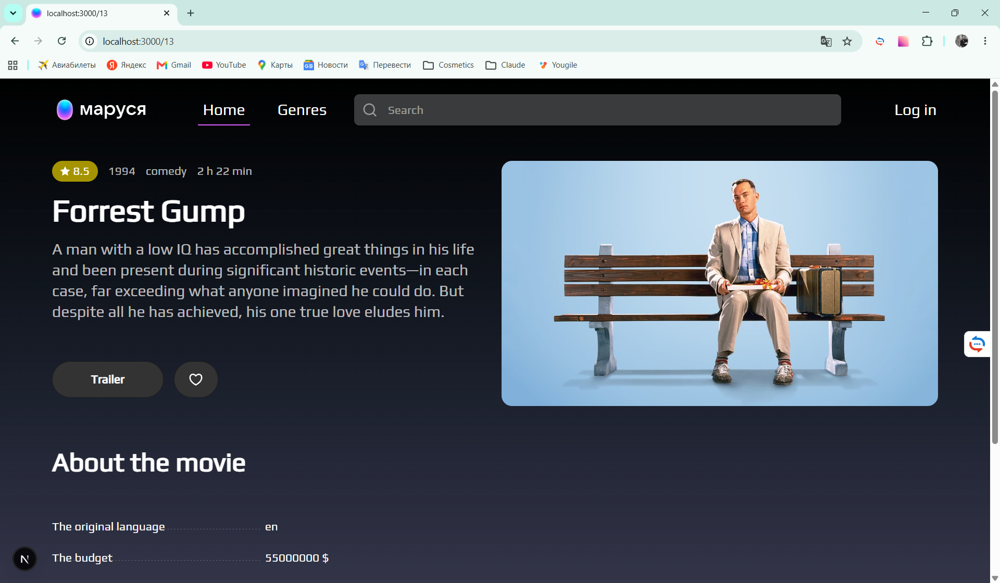
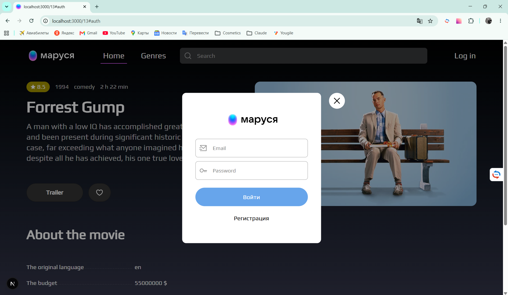
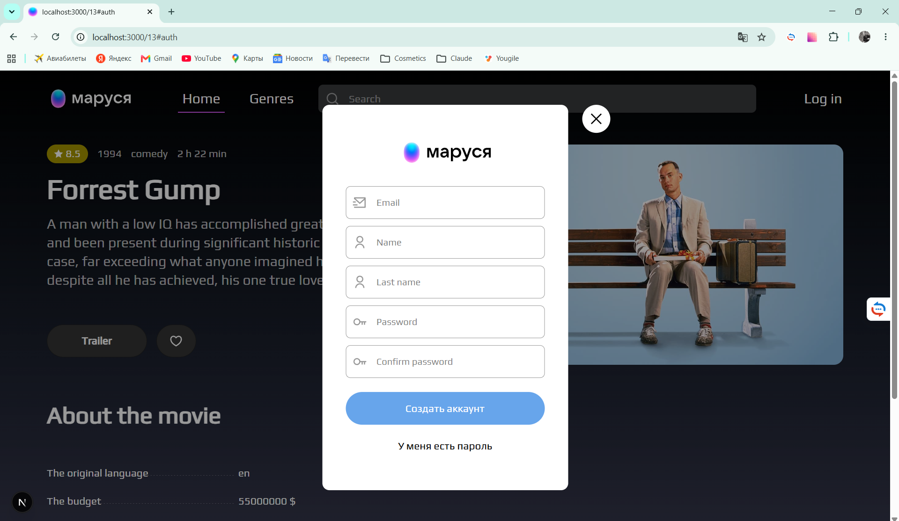
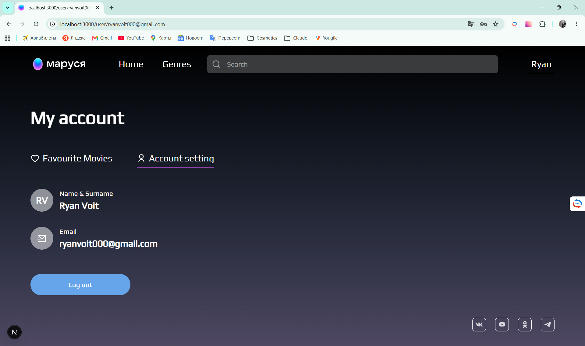
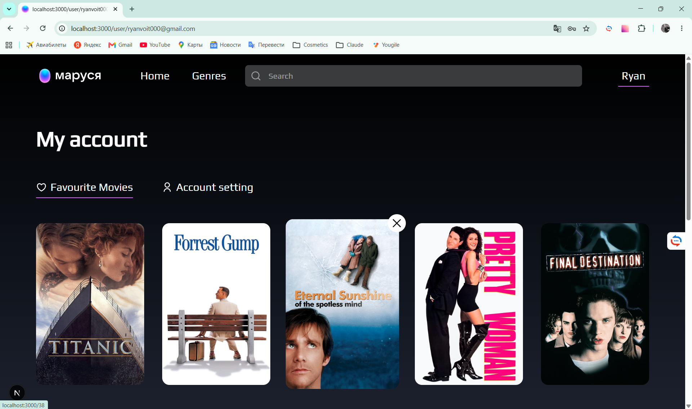
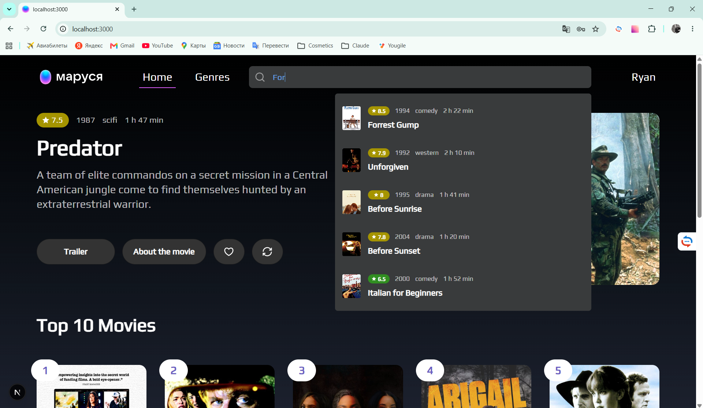

# VK-Marusya

Финальная работа курса «React.js» — бета-версия стримингового сервиса **ВК Маруся**, на котором пользователи могут искать фильмы, смотреть трейлеры, просматривать категории и добавлять картины в избранное.

Данное приложение реализовано с нуля на **React 19** и **Next.js 16** (App Router, Turbopack) с использованием **TypeScript**. Для работы с серверным состоянием и кэшированием запросов используется **TanStack React Query**, HTTP-запросы отправляются через **Axios**, а все ответы API валидируются схемами **Zod**. Формы авторизации и регистрации построены на **React Hook Form** в связке с **@hookform/resolvers**, глобальное состояние интерфейса хранится в **Redux Toolkit** (**react-redux**). Вспомогательные утилиты берутся из **lodash**. Вёрстка сделана на препроцессоре **SASS/SCSS** по методологии **БЭМ** с подключением фреймворка **Tailwind CSS v4**. UI-библиотеки (Bootstrap, MaterialUI и подобные) не использовались — все компоненты написаны вручную по макету.

В качестве бэкенда используется внешний API `https://cinemaguide.skillbox.cc`, документация доступна по адресу <https://cinemaguide.skillbox.cc/docs/>.

## Описание функционала приложения

### Главная страница

При открытии приложения Вы попадаете на главную страницу — дашборд. В верхней её части отображается обложка **случайного фильма**, который приложение предлагает к просмотру, и информация о нём: название, описание, год, жанр, продолжительность и рейтинг IMDb. Рейтинг подсвечивается разным цветом в зависимости от его значения. Здесь же доступны кнопки: *«Трейлер»* — открывает модальное окно со встроенным видео, *«О фильме»* — переходит на страницу фильма, кнопка добавления в избранное и кнопка обновления, которая подгружает новый случайный фильм.



Ниже расположен блок **«Топ 10 фильмов»** — лучшие десять картин по IMDb-рейтингу. При клике на карточку Вы попадаете на страницу конкретного фильма.



### Жанры

На странице **«Жанры»**, куда можно попасть из раздела навигации, представлены все доступные жанры в виде карточек. Список жанров приходит с сервера массивом строк и преобразуется в массив объектов с названием и изображением.



При выборе жанра открывается страница со списком фильмов этой категории, отсортированных по рейтингу. Список подгружается порциями — следующие фильмы дозагружаются по мере необходимости, пока не закончится список. Реализовано через `useInfiniteQuery`.



### Страница фильма

На странице фильма отображается обложка и полная информация о картине: описание, рейтинг, год, страна, жанры, режиссёр, сборы и продолжительность. Кнопка *«Трейлер»* открывает модальное окно с плеером, вторая кнопка добавляет фильм в избранное или удаляет его оттуда, отражая текущее состояние.



### Авторизация и регистрация

Модальное окно авторизации вызывается при нажатии на кнопку *«Войти»* в шапке сайта либо при попытке добавить фильм в избранное неавторизованным пользователем. По умолчанию открывается форма входа, по кнопке *«Регистрация»* содержимое окна меняется на форму регистрации.

Все поля обязательны для заполнения — незаполненные подсвечиваются красной рамкой. Валидация построена на **Zod** в связке с **React Hook Form**: проверяются корректность email, длина пароля и совпадение пароля с его подтверждением. После успешной регистрации появляется окно с сообщением об успехе, после чего можно авторизоваться.





Авторизация работает на сессиях: сервер присылает cookie, которые автоматически прикрепляются к последующим запросам (`withCredentials: true` в Axios). Благодаря этому **при обновлении страницы авторизация не сбрасывается**, как и список избранных фильмов.

### Страница аккаунта

После успешного входа кнопка *«Войти»* в навигации меняется на фамилию пользователя — по клику на неё происходит переход на страницу аккаунта. Там доступны две вкладки: *«Избранное»* — список добавленных фильмов с возможностью удалить любой из них, и *«Настройки аккаунта»* — имя, фамилия и email, указанные при регистрации. По кнопке *«Выйти»* происходит разлогинивание, сессия удаляется с сервера, и пользователь возвращается на главную страницу.





### Поиск

В разделе навигации находится поле поиска. По мере ввода названия подгружается список подходящих фильмов с постером, рейтингом, годом, жанром и длительностью — клик по результату ведёт на страницу фильма. На мобильных разрешениях поиск открывается отдельной кнопкой.



Вёрстка приложения **адаптивная**.

## Ссылка на макет Figma

https://www.figma.com/design/8FW6Yt3ztcoYATQhqiy4qK/%D0%9C%D0%B0%D0%BA%D0%B5%D1%82-VK-%D0%9C%D0%B0%D1%80%D1%83%D1%81%D1%8F-%D0%B4%D0%BB%D1%8F-%D0%B4%D0%B8%D0%BF%D0%BB%D0%BE%D0%BC%D0%B0-Vue%2FReact?node-id=0-1&node-type=canvas

## Запуск приложения

Для того, чтобы запустить приложение надо:

1. Открыть проект и запустить терминал

2. Установить необходимые зависимости, для этого в терминале надо прописать:

```
npm install
```

3. Запустить приложение, для этого в терминале надо прописать:

```
npm run dev
```

4. После запуска в терминале появится строка с ссылкой, по которой надо перейти:

*▲ Next.js 16.2.9 (Turbopack)*

*- Local: http://localhost:3000*

## Сборка проекта

Для сборки production-версии надо прописать в терминале:

```
npm run build
```

А затем запустить собранное приложение:

```
npm start
```

Проверить код линтером можно командой:

```
npm run lint
```

## Структура проекта

Проект разделён на логические директории:

```
src
├── api          — запросы к API и Zod-схемы (movies, auth, favourite)
│   ├── auth        — регистрация, вход, выход, профиль
│   ├── favourite   — добавление, получение и удаление избранного
│   └── movies      — случайный фильм, топ-10, жанры, поиск, фильм по id
├── app          — маршруты Next.js App Router
│   ├── [id]              — страница фильма
│   ├── genres            — список жанров
│   ├── genres/[genre]    — фильмы конкретного жанра
│   └── user/[email]      — страница аккаунта
├── components   — компоненты (Header, Main, Footer, Common)
├── store        — слайсы Redux Toolkit
├── styles       — SCSS: global и components
└── utils        — вспомогательные функции
```

Имена файлов компонентов записаны в **PascalCase**, методы и переменные — в **camelCase**. Компоненты названы существительными, описывающими то, что они отображают, функции работы с API — глаголами, описывающими производимое действие.
